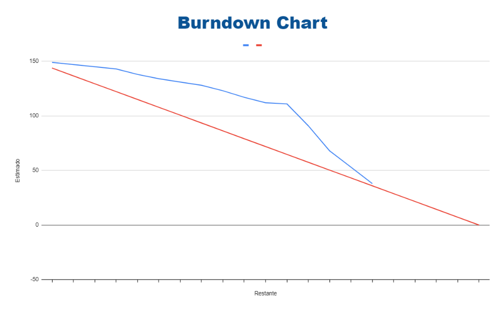

# 
 Morpheus - API 3º Semestre - BD 2024

    

  <a href="#integrantes-da-equipe">Integrantes da Equipe</a> •
  <a href="#descrição-do-desafio">Desafio</a> •
  <a href="#objetivo">Objetivo</a> •
  <a href="#requisitos-funcionais">Requisitos Funcionais</a> •
  <a href="#requisitos-não-funcionais">Requisitos Não Funcionais</a> •
  <a href="#cronograma">Cronograma</a> •
  <a href="#product-backlog">Product Backlog</a> •
  <a href="#grafico-burndown">Gráfico Burndown</a> •
  <a href="#documentação">Documentação</a> •
  <a href="#tecnologias-utilizadas">Tecnologias Utilizadas</a>

 

## :mortar_board: <a id="integrantes-da-equipe"> Integrantes da Equipe: </a>

| **Nome**                   | **Função**            | **LinkedIn**                                                  |
|:----------------------:|:-----------------:|:----------------------------------------------------------:|
| César Truyts           | Scrum Master      |  |
| Ricardo Campos         | Product Owner     |  |
| Elbert Jean         | Desenvolvedor     |  |
| Gabriel Souza           | Desenvolvedor     |  |
| Isaque de Souza           | Desenvolvedor     |  |
| Julio Araujo           | Desenvolvedor     |  |
| Mateus Marques          | Desenvolvedor     |  |
| Paloma Soares  | Desenvolvedor     |  |
| Vinícius Monteiro  | Desenvolvedor     |  |

 

## :anger: <a id=descrição-do-desafio> Descrição do Desafio: </a>

Desenvolver uma ferramenta para captura e armazenamento de notícias estratégicas e dados relevantes associados.

 

## :dart: <a id="objetivo"> Objetivo

Criar um mecanismo para mapeamento de portais de notícias estratégicas, com captura rotineira para geração de histórico. Em um estágio futuro, aplicar análises baseadas em IA e/ou machine learning para cruzamento de dados, visando identificar ações estratégicas para o negócio. Essa estrutura e conceito também devem ser aplicados a APIs que fornecem dados estratégicos, como, por exemplo, previsão do tempo.

 

## :page_facing_up: <a id="requisitos-funcionais"> Requisitos Funcionais </a>

| Funcionalidade                          | Indicador |
|-----------------------------------------|-----------|
| Cadastro de Portais de notícias         | I         |
| Cadastro de APIs                        | II        |
| Cadastro de Tags                        | III       |
| Cadastro de Jornalistas                 | IV        |
| Processo de web scraping                | V         |
| Indicação de tags que estão relacionadas| VI        |
| Tela de consulta de notícias            | VII       |
| Tela de APIs                            | VIII      |

 

## :page_with_curl: <a id="requisitos-não-funcionais"> Requisitos Não Funcionais </a>

* Prever um grande volume de notícias armazenas
* Utilizar softwares livres
* Manual do Usuário
* Guia de instalação
* Java (linguagem de programação, frameworks e APIs)
* Documentação API – Application Programming Interface com OpenID
* Modelagem de Banco de Dados ou Arquivo de dados.
* Deverá ser uma aplicação web.
* O front-end deve ser desenvolvido de forma minimalista.

 

## :calendar: <a id="cronograma"> Cronograma </a>

| Sprint  | Nome | Data inicio  | Data Fim | Status |
| ------------- | ------------- | ------------- | ------------- | ------------- |
| --  | KickOff   | 26/08   | 30/08 | Ok |
|  1  | Sprint 1   | 09/09   | 29/09 | Ok |
|  2  | Sprint 2   | 30/09   | 20/10 |  |
|  3  | Sprint 3   | 21/10   | 10/11 |  |
|  4  | Sprint 4   | 11/11   | 30/11 |  |
|  5  | Feira de Soluções  | 12/12     |

 

## :date: <a id="product-backlog"> Product BackLog: </a>
| Identificador | Como     | Desejo                                                                                                                                                                                                | Sprint | Prioridade | Dependência | Requisito     |
|---------------|----------|-------------------------------------------------------------------------------------------------------------------------------------------------------------------------------------------------------|--------|------------|-------------|---------------|
| A             | Analista | Gerenciar portais de notícias por uma interface que me permita cadastrar endereços e possíveis autores das notícias                                                                                   | 1      | Alta       | -           | I             |
| B             | Analista | Gerenciar tags, sendo essas conteúdos textuais livres, considerando regionalismo e palavras polissêmicas                                                                                             | 1      | Alta       | -           | III           |
| C             | Analista | Tratar sinônimos de tags, para que a aplicação possa contemplar regionalismo nos textos das tags                                                                                                      | 2      | Alta       | B           | VI            |
| D             | Analista | Registrar dados provenientes de portais de notícias                                                                                                                                                   | 2      | Média      | C           | VII e IV      |
| F             | Analista | Filtrar os dados de uma consulta de dados provenientes de portais de notícias, utilizando tags tratadas para complementar regionalismos linguísticos, mediante a uma análise do conteúdo registrado  | 3      | Média      | D           | VII e VI      |
| G             | Analista | Filtrar os dados de uma consulta de dados provenientes de portais de notícias, utilizando filtros referentes aos dados de um portal de notícias                                                        | 3      | Média      | D           | VII e VI      |
| H             | Analista | Gerenciar fontes de dados provenientes de APIs (Interface de Programação de Aplicações) por meio de uma interface que me permita cadastrar endereços                                                  | 4      | Baixa      | -           | II            |
| I             | Analista | Registrar dados provenientes de fontes de dados provenientes de APIs vinculadas à sua devida fonte e à sua data de registro                                                                           | 4      | Baixa      | H           | VIII e IV     |
| J             | Analista | Filtrar os dados de uma consulta de dados provenientes de fonte de dados (API), utilizando tags tratadas para complementar regionalismos linguísticos, mediante a uma análise do conteúdo registrado | 4      | Baixa      | I           | VII e VI      |
| K             | Analista | Filtrar os dados de uma consulta de dados provenientes de fonte de dados (API), utilizando filtros referentes aos dados de uma fonte de dados (API)                                                   | 4      | Baixa      | I           | VII e VI      |
| L             | Analista | Filtrar os dados de uma consulta de dados provenientes de fonte de dados (API), utilizando filtros referentes aos dados de um registro proveniente de uma fonte de dados (API)                       | 4      | Baixa      | I           | VII e VI      |

 

## :chart_with_upwards_trend: <a id="grafico-burndown"> Gráfico Burndown </a>

    

 

## Board de Atividades

Acesse o Board de atividades do Time para visualizar as atividades planejadas, em desenvolvimento e prontas.

[Board de Atividades](https://github.com/orgs/Morpheus-Fatec/projects/1/views/1)

 

## :page_with_curl: <a id="documentação"> Documentação </a>

Todo o material relacionado à documentação do projeto pode ser encontrado no diretório [documentação](./documentation/).

### Estrutura da Documentação:
- **[Diagrams](./documentation/diagrams/)**: Contém os diagramas e esquemas do projeto, incluindo o Diagrama Entidade-Relacionamento (DER) e diagramas de arquitetura.
- **[API](./documentation/api/)**: Contém a especificação da API, exemplos de requisições e respostas, e guias de autenticação.
- **[Manuais](./documentation/manuals/)**: Contém manuais do usuário, guias de instalação, configuração e resolução de problemas.
- **[Imagens](./documentation/images/)**: Contém imagens de utilização geral no projeto.

 

## :page_with_curl: Documentação

Todo o material relacionado à documentação do projeto pode ser encontrado no diretório [documentação](./documentation/).

### Estrutura da Documentação:
- **[Diagrams](./documentation/diagrams/)**: Contém os diagramas e esquemas do projeto, incluindo o Diagrama Entidade-Relacionamento (DER) e diagramas de arquitetura.
- **[API](./documentation/api/)**: Contém a especificação da API, exemplos de requisições e respostas, e guias de autenticação.
- **[Manuais](./documentation/manuals/)**: Contém manuais do usuário, guias de instalação, configuração e resolução de problemas.

## :bookmark: <a id="tecnologias-utilizadas"> Tecnologias Utilizadas </a>
> * [Java](https://www.java.com/pt-BR/) - Versão 21
> * [JavaScript](https://developer.mozilla.org/pt-BR/docs/Web/JavaScript) - Versão ES6+
> * [MySQL](https://www.mysql.com/) - Versão 8.0
> * [JDBC MySQL](https://dev.mysql.com/downloads/connector/j/) - Versão 8.0.26
> * [Maven](https://maven.apache.org/) - Versão 3.8.1
> * [Spring Boot](https://spring.io/projects/spring-boot) - Versão 3.3.3
> * [Vue.js](https://vuejs.org/) - Versão 3
> * [Git](https://git-scm.com/)
> * [GitHub](https://github.com/)
> * [Intellij](https://www.jetbrains.com/pt-br/idea/)
> * [VisualStudioCode](https://visualstudio.microsoft.com/pt-br/)
> * [Discord](https://discord.com/)
> * [Slack](https://slack.com/)
> * [Google Docs](https://docs.google.com/)
