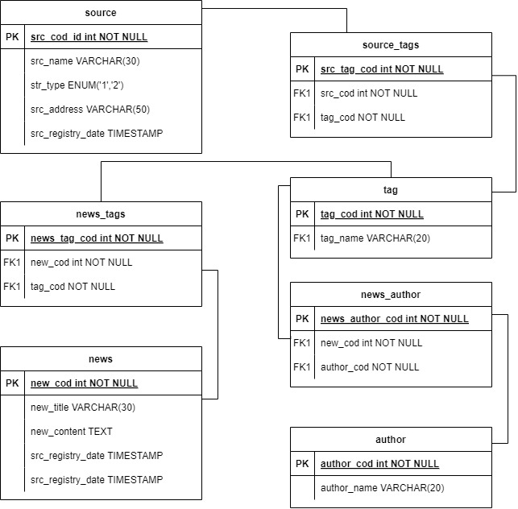

# Documentação

## Backlog do Produto
- [Sprint 1](#sprint-1)
   - [Gerenciar Portais de Notícias](#gerenciar-portais-de-notícias)
   - [Gerenciar Tags](#gerenciar-tags)

- [Sprint 2:](#sprint-2)
  - [Registrar dados provenientes de Portais de Notícias](#registrar-dados-de-portais-de-noticias)
   - [Tratar sinônimos de tags](#tratar-sinonimos-de-tags)

## Entidade Relacionamento

# Sprint 1:

## <a id="gerenciar-portais-de-notícias">Gerenciar Portais de Notícias por uma interface que me permita cadastrar endereços e possíveis autores das notícias.</a>

### Critérios de Aceitação:

1. **Cadastro de Portais**:
   - O sistema deve permitir o cadastro de portais de notícias, incluindo o URL e o nome do portal.

2. **Relacionamento de Tags**:
   - O sistema deve permitir relacionar várias tags a cada portal cadastrado.

3. **Edição e Remoção**:
   - O sistema deve permitir a edição e remoção de portais e suas tags já cadastradas.

4. **Interface de Usuário**:
   - A interface deve ser intuitiva, permitindo que os usuários visualizem a lista de portais e suas respectivas tags de forma clara.

5. **Performance**:
   - O sistema deve ser capaz de cadastrar, editar e remover portais e tags de forma rápida e eficiente.

6. **Documentação**:
   - A documentação deve ser atualizada para refletir as funcionalidades relacionadas ao gerenciamento de portais de notícias.

## <a id="gerenciar-tags"> Gerenciar Tags, sendo essas conteúdos textuais livres, considerando regionalismo e palavras polissêmicas. </a>

### Critérios de Aceitação
1. **Cadastro de Tags**:
   - O sistema deve permitir o cadastro de tags como conteúdos textuais livres.

2. **Edição e Remoção**:
   - O sistema deve permitir a edição e remoção de tags já cadastradas.

3. **Interface de Usuário**:
   - A interface deve ser intuitiva, permitindo que os usuários visualizem e gerenciem as tags de forma clara.

4. **Performance**:
   - O sistema deve ser capaz de cadastrar, editar e remover tags de forma rápida e eficiente.

5. **Documentação**:
   - A documentação deve ser atualizada para refletir as funcionalidades relacionadas ao gerenciamento de tags.

# Sprint 2:

## <a id="registrar-dados-de-portais-de-noticias">Registrar dados provenientes de portais de notícias vinculando uma notícia ao seu devido autor e a data de sua publicação e registro </a>

### Critérios de aceitação:

1. **Coleta de Dados**:
   - O sistema deve extrair os dados pertinentes da notícia a partir do conteúdo da página, incluindo título, conteúdo principal, autor e data de publicação, assegurando que apenas as informações relevantes sejam coletadas.

2. **Armazenamento**:
   - Os dados coletados devem ser armazenados em um banco de dados estruturado, com campos separados para título, conteúdo, autor e data.

3. **Validação de Dados**:
   - O sistema deve validar que o autor e a data estão no formato correto antes de armazenar as informações.

4. **Performance**:
   - O sistema deve ser capaz de registrar e acessar os dados de forma rápida e eficiente, mesmo com um grande volume de notícias.

5. **Documentação**:
   - A documentação deve ser atualizada para refletir as funcionalidades do sistema.

## <a id="tratar-sinonimos-de-tags">Tratar sinônimos de tags, para que a aplicação possa contemplar regionalismo nos textos das tags</a>

1. **Cadastro de Palavras**:
   - O sistema deve permitir o cadastro de palavras que serão utilizadas como tags.

2. **Relação de Sinônimos**:
   - O sistema deve possibilitar a relação de cada palavra a uma lista de sinônimos, permitindo a inclusão de várias palavras associadas a uma única tag.

3. **Geração de Tags**:
   - Ao cadastrar uma tag, o sistema deve gerar automaticamente as tags correspondentes, substituindo as palavras pelos sinônimos cadastrados.

4. **Interface de Usuário**:
   - A interface deve permitir que os usuários visualizem e editem as relações de sinônimos de forma intuitiva.

5. **Validação**:
   - O sistema deve validar que as palavras e sinônimos cadastrados não sejam duplicados.

6. **Performance**:
   - O sistema deve gerar as tags sinônimas de forma rápida, mesmo com um grande volume de palavras e sinônimos cadastrados.

7. **Documentação**:
   - A documentação deve ser atualizada para refletir as funcionalidades relacionadas ao tratamento de sinônimos de tags.

# Sprint 3:

## <a id="tratar-sinonimos-de-tags">Tratar sinônimos de tags, para que a aplicação possa contemplar regionalismo nos textos das tags</a>

### Critérios de aceitação:

1. **Cadastro de Palavras**:
   - O sistema deve permitir o cadastro de palavras que serão utilizadas como tags.

2. **Relação de Sinônimos**:
   - O sistema deve possibilitar a relação de cada palavra a uma lista de sinônimos, permitindo a inclusão de várias palavras associadas a uma única tag.

3. **Geração de Tags**:
   - Ao cadastrar uma tag, o sistema deve gerar automaticamente as tags correspondentes, substituindo as palavras pelos sinônimos cadastrados.

4. **Interface de Usuário**:
   - A interface deve permitir que os usuários visualizem e editem as relações de sinônimos de forma intuitiva.

5. **Validação**:
   - O sistema deve validar que as palavras e sinônimos cadastrados não sejam duplicados.

6. **Performance**:
   - O sistema deve gerar as tags sinônimas de forma rápida, mesmo com um grande volume de palavras e sinônimos cadastrados.

7. **Documentação**:
   - A documentação deve ser atualizada para refletir as funcionalidades relacionadas ao tratamento de sinônimos de tags.

## <a id="registrar-dados-de-portais-de-noticias">Registrar dados provenientes de portais de notícias vinculando uma notícia ao seu devido autor e a data de sua publicação e registro</a>

### Critérios de aceitação:

1. **Coleta de Dados**:
   - O sistema deve extrair os dados pertinentes da notícia a partir do conteúdo da página, incluindo título, conteúdo principal, autor e data de publicação, assegurando que apenas as informações relevantes sejam coletadas.

2. **Armazenamento**:
   - Os dados coletados devem ser armazenados em um banco de dados estruturado, com campos separados para título, conteúdo, autor e data.

3. **Validação de Dados**:
   - O sistema deve validar que o autor e a data estão no formato correto antes de armazenar as informações.

4. **Performance**:
   - O sistema deve ser capaz de registrar e acessar os dados de forma rápida e eficiente, mesmo com um grande volume de notícias.

5. **Documentação**:
   - A documentação deve ser atualizada para refletir as funcionalidades do sistema.
  
# Sprint 4

## Registrar dados provenientes de fontes de dados provenientes de APIs vinculadas à sua devida fonte e à sua data de registro

### Critérios de aceitação

1. **Coleta de Dados**:
   - O sistema deve extrair os dados pertinentes dos dados a partir das respostas da API (Interface de Programação de Aplicações), assegurando que apenas as informações relevantes sejam coletadas.

2. **Armazenamento**:
   - Os dados coletados devem ser armazenados em um banco de dados estruturado, com campos separados para conteudo e data.

4. **Performance**:
   - O sistema deve ser capaz de registrar e acessar os dados de forma rápida e eficiente, mesmo com um grande volume de dados.

5. **Documentação**:
   - A documentação deve ser atualizada para refletir as funcionalidades do sistema.
  
## Filtrar dados de uma consulta de dados provenientes de uma API, utilizando filtros referentes aos dados de um registro específico

### Critérios de aceitação

1. **Definição de Filtros**:
   - O sistema deve permitir a aplicação de filtros específicos para os dados de um registro individual proveniente da API, como dados de identificação, categoria e data.

2. **Coerência dos Dados**:
   - Os filtros devem retornar dados que correspondem exatamente aos critérios aplicados, assegurando precisão na filtragem por registro.

3. **Performance**:
   - A aplicação dos filtros deve ocorrer de forma rápida e eficiente, sem comprometer o desempenho do sistema.

4. **Documentação**:
   - A documentação deve ser atualizada para incluir informações sobre a configuração e o uso dos filtros de registro.

## Filtrar dados de uma consulta de dados provenientes de uma API, utilizando filtros referentes aos dados da fonte de dados

### Critérios de aceitação

1. **Definição de Filtros**:
   - O sistema deve possibilitar a aplicação de filtros baseados nas características gerais dos dados provenientes da fonte, como tipo de fonte, categoria de dados e parâmetros de origem.

2. **Coerência dos Dados**:
   - Os dados retornados devem refletir as condições gerais aplicadas, garantindo que todos os dados exibidos atendam aos critérios da fonte especificada.

3. **Performance**:
   - O sistema deve ser capaz de aplicar esses filtros rapidamente, mesmo com um grande volume de dados da fonte.

4. **Documentação**:
   - A documentação deve incluir orientações para a configuração e uso dos filtros de fonte de dados.

## Filtrar dados de uma consulta de dados provenientes de uma API, utilizando tags para complementar regionalismos linguísticos, mediante análise do conteúdo registrado

### Critérios de aceitação

1. **Definição de Tags**:
   - O sistema deve permitir a aplicação de tags que complementem regionalismos linguísticos, mapeando sinônimos ou variações regionais, com base na análise do conteúdo registrado.

2. **Coerência dos Dados**:
   - Os dados filtrados devem corresponder aos critérios de regionalismo especificados, assegurando que as variações linguísticas estejam bem representadas.

3. **Performance**:
   - O sistema deve aplicar as tags de forma eficiente, permitindo uma consulta rápida mesmo ao usar filtros linguísticos complexos.

4. **Documentação**:
   - A documentação deve detalhar como configurar e utilizar tags para filtros de regionalismo linguístico.

