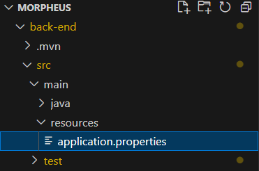

# Passo a Passo para Conexão com o Banco de Dados (MySQL e Hibernate)

## 1º Passo: Dependências do Maven

Verifique se as dependências necessárias para o Hibernate e o MySQL estão presentes no arquivo pom.xml. Adicione as seguintes dependências se ainda não estiverem:

```
<dependency>
    <groupId>org.springframework.boot</groupId>
    <artifactId>spring-boot-starter-data-jpa</artifactId>
</dependency>
<dependency>
    <groupId>mysql</groupId>
    <artifactId>mysql-connector-java</artifactId>
    <version>8.0.XX</version> <!-- substitua pela versão correta -->
</dependency>
```


## 2º Passo: Abrir o MySQL Workbench

Vá até o MySQL Workbench e procure por **"Database"**.


## 3º Passo: Acessar Gerenciamento de Conexões

Clique em **"Database"**, e depois selecione **"Manage Connections..."**.


## 4º Passo: Obtenção das Informações de Conexão

Em **"Manage Connections"**, você verá as informações necessárias para configurar o banco de dados no seu projeto, como **Hostname**, **Port**, **Username** e **Password**.


## 5º Passo: Configuração no `application.properties`

Navegue até o arquivo `application.properties` no seguinte diretório:



Dentro desse arquivo, insira as seguintes informações do banco de dados:

```
properties
spring.datasource.url=jdbc:mysql://localhost:3306/<nome_do_banco>
spring.datasource.username=<seu_usuario>
spring.datasource.password=<sua_senha>
spring.jpa.hibernate.ddl-auto=update
spring.jpa.show-sql=true
```

## 6º Passo: Executar o Comando Maven

Após configurar corretamente o arquivo `application.properties`, execute o seguinte comando no terminal:

mvn clean install

# Conclusão

Com esses passos detalhados, você agora possui uma conexão bem estabelecida entre seu aplicativo Spring Boot e o banco de dados MySQL utilizando Hibernate. 

O processo envolveu:

1. Adição das dependências necessárias no arquivo pom.xml
2. Configuração do MySQL Workbench para obter as informações de conexão
3. Configuração do arquivo application.properties com os detalhes do banco de dados
4. Execução do comando Maven para compilar e instalar o projeto

Ao seguir esses passos, você terá um ambiente configurado e pronto para interagir com seu banco de dados MySQL através do Hibernate em sua aplicação Spring Boot.

Lembre-se de substituir `<nome_do_banco>`, `<seu_usuario>` e `<sua_senha>` pelos valores reais da sua conexão ao banco de dados.

Com esta configuração, você poderá agora criar, ler, atualizar e excluir registros no banco de dados usando as entidades JPA definidas em seu projeto.

Boa prática: Sempre mantenha suas credenciais de banco de dados seguras e não compartilhe-as publicamente ou incluí-las diretamente nos arquivos de configuração. Considere usar variáveis de ambiente ou um serviço de gerenciamento de segredos para armazenar informações sensíveis.

Parabéns! Você agora tem uma conexão bem estabelecida com seu banco de dados MySQL através do Hibernate em sua aplicação Spring Boot.
